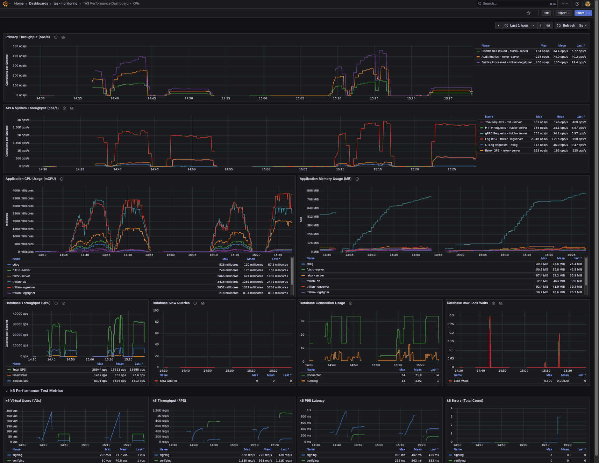

# RHTAS Performance Analysis Infrastructure

This repository provides tools for deploying and conducting performance analysis on the Red Hat Trusted Artifact Signer (RHTAS) stack.

## Disclaimer

> [!CAUTION]
> This repository is **not stable** and may change at any time. The content provided here **may be incompatible** with past, current, or future versions of Red Hat Trusted Artifact Signer (RHTAS).

## Prerequisites

- OpenShift cluster access (`oc` CLI tool installed and logged in)
- Ansible and required Python dependencies (the `deploy.sh` script will set up a virtual environment automatically)

## Quick Start

### Deploy Infrastructure

```bash
# Deploy baseline configuration
make deploy-baseline

# OR deploy optimized configuration (high resources & affinity)
make deploy-optimized
```

### Clean Up

```bash
# Remove only applications (keeps operators)
make clean-apps

# Remove everything including operators
make clean
```

## Available Make Commands

### Infrastructure
- `make deploy` or `make deploy-baseline` - Deploy baseline RHTAS configuration
- `make deploy-optimized` - Deploy optimized RHTAS configuration
- `make clean-apps` - Remove applications only (keeps operators)
- `make clean` - Remove everything including operators
- `make check` - Verify prerequisites
- `make status` - Show deployment status

### Performance Tests

**Signing Tests:**
- `make sign-smoke` - Simple 1 VU, 1 iteration test
- `make sign-load` - Light load test with 20 VUs
- `make sign-optimal-range` - Production load test with 100 VUs
- `make sign-stress` - High-load stress test
- `make sign-fill` - Pre-seed database with 10,000 entries

**Verifying Tests:**
- `make generate-verify-data` - Generate UUID needed for verification tests
- `make verify-smoke` - Simple 1 VU, 1 iteration test
- `make verify-load` - Light load test with 80 VUs (requires `UUID=<uuid>`)
- `make verify-optimal-range` - Production load test with 100 VUs (requires `UUID=<uuid>`)
- `make verify-stress` - High-load stress test (requires `UUID=<uuid>`)

## Configuration

### Default Test Credentials

- **Keycloak OIDC User**: `jdoe@redhat.com` / `secure`
- **Grafana Admin**: `admin` / `admin`
- **Certificate Email**: `jdoe@redhat.com`

These are hardcoded for test environment compatibility.

## Monitoring

The deployed infrastructure includes a Grafana instance with a custom dashboard for real-time performance insights.



## License

This project is licensed under the Apache 2.0 License. See the [LICENSE](LICENSE) file for details.
